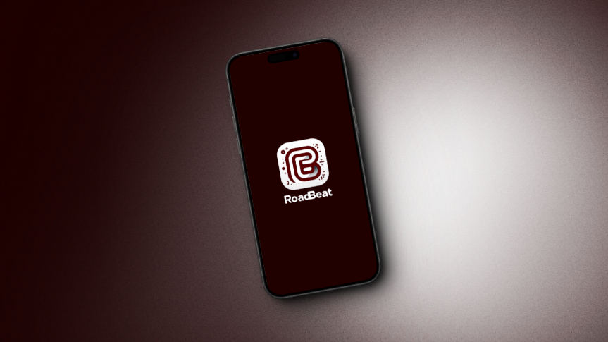

# RoadBeat

**RoadBeat** es una aplicación móvil para mejorar la experiencia de los viajes compartidos a través de la música. Permite a los usuarios crear y unirse a salas de reproducción para compartir y sincronizar canciones en tiempo real. Este proyecto es mi Trabajo de Fin de Grado (TFG) del ciclo superior de Desarrollo de Aplicaciones Multiplataforma. Decidí utilizar **React Native** por mero aprendizaje del framework, ya que es una tecnología popular y multiplataforma que permite desarrollar aplicaciones tanto para Android como para iOS con un único código base.

## Tecnologías Utilizadas

- **Frontend ->** React Native
- **Backend ->** Spring Boot & Hibernate
- **Servicios Externos ->** API de Spotify, Azure, Socket.IO

## Instalación

### Requisitos

- Node.js
- Expo CLI

### Instrucciones

1. *Clona el repositorio:*
    ```bash
   git clone https://github.com/SCrbnll/RoadBeat.git
   ```
2. *Navega a la rama desarrollo:*
     ```bash
    git checkout desarrollo
    ```
3. *Instala las dependencias:*
    ```bash
    npm install
    ```

4. *Inicia la aplicación:*
    ```bash
    npx expo start
    ```

## Proyectos auxiliares
- Backend y Base de Datos
   - *El proyecto de la API de Spring Boot y la base de datos se encuentra en la rama **bbdd-api.***

- Servidor de Socket.IO
   - *El servidor de Socket.IO se encuentra en la rama **sockets.***

    


## Trailer de la aplicación
https://youtu.be/X9w92oRiqTY
